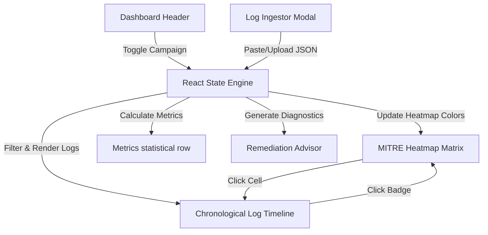

# MITRE ATT&CK Coverage & Gap Mapping Dashboard Overview

This briefing provides a detailed overview of the **MITRE ATT&CK Coverage Dashboard** (located at `C:\Users\user\Documents\AntiGravity\MITRE`), detailing its core capabilities, components, interactions, and repository details.

---

## 1. Project Context & Purpose

The **MITRE ATT&CK Coverage & Gap Mapping Dashboard** is a stateful, interactive web application designed for a cybersecurity portfolio. It showcases the ability to ingest security logs, map them dynamically to the MITRE ATT&CK matrix, calculate detection coverage, highlight visibility gaps or blind spots, and recommend actionable GPO/PowerShell/Registry remediations.

* **Target URL:** `https://attack-coverage-agent-git-main-brianna-wandt-s-projects.vercel.app/`
* **GitHub Repository:** [briwandt/attack-coverage-agent](https://github.com/briwandt/attack-coverage-agent.git)
* **Local Workspace Root:** [MITRE Workspace](file:///C:/Users/user/Documents/AntiGravity/MITRE)

---

## 2. Core Components

The project consists of two main parts: a modern stateful Next.js application (active) and a vanilla HTML/CSS/JS prototype (archived).

### A. Next.js 16 Web Application (Active)
Located at the root of [C:\Users\user\Documents\AntiGravity\MITRE](file:///C:/Users/user/Documents/AntiGravity/MITRE), this is a React application built with Vanilla CSS and TailwindCSS v4.

1. **Enterprise ATT&CK Matrix Heatmap ([app/page.tsx](file:///C:/Users/user/Documents/AntiGravity/MITRE/app/page.tsx)):**
   - A 12-column grid representing core Enterprise tactics (Initial Access, Execution, Persistence, Privilege Escalation, Credential Access, Discovery, Lateral Movement, Collection, Command & Control, Exfiltration, Credential Access, Impact).
   - Technique cells are dynamically color-coded based on active coverage:
     - 🟢 **Active / Fully Covered (Green):** Telemetry is captured and an alert rule is active.
     - 🟡 **Telemetry Gap / Partial (Amber):** Telemetry is captured, but missing critical configurations (e.g., missing command-line logging).
     - 🔴 **Blind Spot / Unmonitored (Red):** Zero telemetry is configured or received for this behavior.
     - ⚫ **Inactive / Unmonitored (Dark Grey):** Tactic is not active in the current threat scenario.

2. **Preloaded Synthetic Campaigns ([src/data/campaigns.ts](file:///C:/Users/user/Documents/AntiGravity/MITRE/src/data/campaigns.ts)):**
   - Preloaded logs mapped to three high-fidelity attack campaigns:
     - **APT29 Spearphishing:** Phishing email attachment leading to execution, PowerShell payloads, and LSASS memory dumping.
     - **LockBit Ransomware:** Shadow copy deletion, local discovery, and data encryption.
     - **Entra ID Cloud Access Abuse:** Identity compromise, OAuth application abuse, and subsequent exfiltration.

3. **Chronological Log Timeline ([app/page.tsx](file:///C:/Users/user/Documents/AntiGravity/MITRE/app/page.tsx)):**
   - Renders security logs chronologically. Clicking on a log entry expands it into a fully indented JSON viewer with custom color-coded syntax highlighting.
   - Every log includes a **MITRE Technique Badge** linking to the heatmap.

4. **Gap Diagnostics & Remediation Advisor ([app/page.tsx](file:///C:/Users/user/Documents/AntiGravity/MITRE/app/page.tsx)):**
   - Displays real-time metric counters: *Total Evaluated*, *Configured Detections*, *Visibility Gaps*, and *Blind Spots*.
   - Renders remediation cards that expand to show step-by-step instructions, PowerShell command lines, registry keys, or GPO settings to resolve telemetry gaps (e.g., enabling Process Creation Auditing with Command Line Event ID 4688 or Script Block Logging Event ID 4104).

5. **Log Ingestor & Uploader Modal ([app/page.tsx](file:///C:/Users/user/Documents/AntiGravity/MITRE/app/page.tsx)):**
   - Allows users to drag and drop or paste custom JSON arrays to dynamically parse schemas, map T-codes, and update coverage matrices in real time.

---

### B. Vanilla Prototype (Archived)
Located in [C:\Users\user\Documents\AntiGravity\MITRE\vanilla](file:///C:/Users/user/Documents/AntiGravity/MITRE/vanilla), this is a standalone static prototype using standard HTML5 and pure JavaScript.

- **[index.html](file:///C:/Users/user/Documents/AntiGravity/MITRE/vanilla/index.html):** Structure of the dashboard grid.
- **[styles.css](file:///C:/Users/user/Documents/AntiGravity/MITRE/vanilla/styles.css):** Glassmorphic surface stylings and cyberpunk themes.
- **[app.js](file:///C:/Users/user/Documents/AntiGravity/MITRE/vanilla/app.js) / [campaigns.js](file:///C:/Users/user/Documents/AntiGravity/MITRE/vanilla/campaigns.js):** DOM-manipulation logic and baseline campaign structures.

---

## 3. Key Connections & Interactions

* **Bi-directional Navigation:** 
  - Clicking on a MITRE Technique Badge in the log timeline scrolls to and highlights the corresponding cell in the matrix heatmap.
  - Clicking on a technique cell inside the matrix filters the timeline logs and scrolls the matching log into view.
* **Unified Metrics Calculations:**
  - Choosing a campaign or uploading logs updates all metrics dynamically, immediately changing matrix colors and population lists.

---

## 4. History (Memory Audit)

Historical records from the `Reviewing_CTI_Dashboard` and `MITRE_Coverage_Dashboard` conversations have been cataloged in:
* **[MITRE_Coverage_Dashboard Memory Folder](file:///C:/Users/user/Documents/AntiGravity/MITRE/memory/MITRE_Coverage_Dashboard)**
  - `implementation_plan.md`: Setup for simulated gaps (WinRM blindspot, Script Block Logging gap) and remediation structures.
  - `task.md`: Tasks for anchoring matrix scrolls and JSON highlights.
  - `walkthrough.md`: Original integration steps into Next.js.
