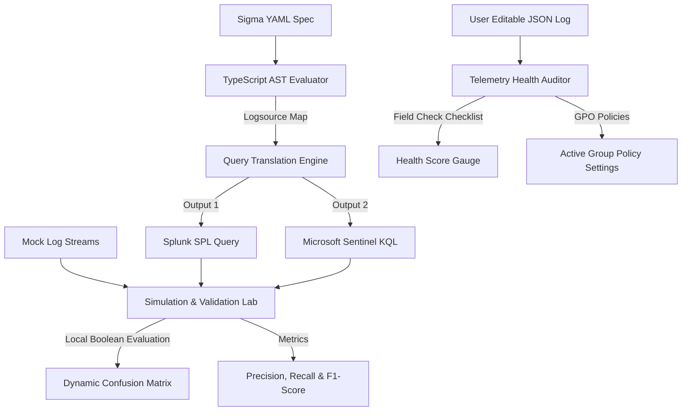

# Unified Detection Engineering Portfolio Walkthrough (Athena + MITRE)

This document acts as an operation manual and project walkthrough for the **Unified Detection Engineering Portfolio**—a fully client-side Detection-as-Code (DaC), validation, and telemetry audit dashboard built using Next.js, React, TypeScript, and Tailwind CSS.

---

## 🏗️ Architecture Overview

The unified portfolio demonstrates the complete **Threat Detection Engineering Lifecycle** running entirely in the browser:



---

## 💻 Interactive Detection-as-Code (DaC) Playground

To make the platform an active, hands-on workspace for writing, testing, and implementing detections, we added the interactive **DaC Playground** workspace:
- **Live Sigma YAML Editor**: A monospaced code editing workspace featuring dynamic client-side parsing. It validates YAML syntax on-the-fly and displays validation status badges (Valid/Malformed).
- **Dual SIEM Compiler Pipeline**: Instantly compiles user-edited rules into functional Splunk SPL and Microsoft Sentinel KQL queries, updating dynamically as the engineer edits the logic.
- **Log Evaluation Simulator**: Allows the engineer to input/paste a telemetry event payload in JSON format (pre-populated with starter logs). Clicking "Evaluate Detection Logic" evaluates the YAML selectors and boolean condition rules client-side to output an immediate green/amber alert trigger feedback state.

---

## 🗃️ Registry Rules (YAML) & Compiled Outputs

We implemented 5 production-grade detection rules targeting Windows Endpoint (Sysmon), Identity (Active Directory), Cloud (AWS CloudTrail / Entra ID), and Network (DNS) domains. The TypeScript engine translates them instantly:

### 1. Windows Endpoint: LSASS Memory Dumping (Sysmon Event ID 10)
* **Concept**: Detects unauthorized process access requests targeting `lsass.exe` requesting specific permissions (`0x1010`, `0x1410`, `0x1F1F`), while filtering out trusted platform processes like Svchost and Windows Defender.
* **Sigma/YAML Rule**: Stored inside [athena_data.ts](file:///c:/Users/user/Documents/AntiGravity/detection%20engineering/src/data/athena_data.ts#L77-L103)
* **Splunk SPL Compilation**:
  ```sql
  index=ep_sysmon sourcetype="XmlWinEventLog:Microsoft-Windows-Sysmon/Operational" (EventID="10" AND TargetImage="C:\Windows\System32\lsass.exe" AND GrantedAccess IN ("0x1010", "0x1410", "0x1F1F")) AND NOT (SourceImage="C:\Program Files\Windows Defender\MsMpEng.exe" OR SourceImage="C:\Windows\System32\svchost.exe")
  ```
* **Sentinel KQL Compilation**:
  ```sql
  SysmonEventLogs
  | where (EventID == 10 and TargetImage == "C:\Windows\System32\lsass.exe" and GrantedAccess in ("0x1010", "0x1410", "0x1F1F")) and not (SourceImage == "C:\Program Files\Windows Defender\MsMpEng.exe" or SourceImage == "C:\Windows\System32\svchost.exe")
  ```

### 2. Active Directory: Kerberoasting Attack (AD Security Event ID 4769)
* **Concept**: Detects Service Ticket Requests utilizing weak RC4 encryption (`0x17`) for user-accounts, while filtering out machine computer accounts (ending in `$`) and the domain controller ticket-granting account (`krbtgt`).
* **Sigma/YAML Rule**: Stored inside [athena_data.ts](file:///c:/Users/user/Documents/AntiGravity/detection%20engineering/src/data/athena_data.ts#L142-L164)
* **Splunk SPL Compilation**:
  ```sql
  index=ad_security sourcetype="WinEventLog:Security" (EventID="4769" AND TicketEncryptionType="0x17") AND NOT (ServiceName="*$" OR ServiceName="krbtgt")
  ```
* **Sentinel KQL Compilation**:
  ```sql
  SecurityEvent
  | where (EventID == 4769 and TicketEncryptionType == "0x17") and not (ServiceName endswith "$" or ServiceName == "krbtgt")
  ```

---

## 🧪 Simulation and Rule Validation Lab (Purple Teaming)

The **Simulation & Validation Lab** executes detection rules locally against mock purple team attack datasets containing simulated threat events (True Positives) and normal system noise (True Negatives).

During evaluation, the validation engine:
1. Loads the rule's simulated dataset.
2. Evaluates the boolean condition logic of the YAML selectors on each log record in real-time.
3. Computes:
   * **Precision**: Measures alert quality ($TP / (TP + FP)$). Low precision means high alert fatigue for SOC.
   * **Recall**: Measures coverage ($TP / (TP + FN)$). Low recall means critical security blindspots.
   * **F1-Score**: Harmonic accuracy mean ($2 \times \frac{Precision \times Recall}{Precision + Recall}$).
   * **Confusion Matrix**: 2x2 grid visualizing TP, FP, FN, TN.

---

## 📊 Telemetry Health & Gap Analysis

The **Telemetry Health Auditor** assesses log schemas to discover ingestion issues:
* It audits user-editable log JSON records against specific schema requirements.
* It highlights missing fields (e.g. if Sysmon Event ID 10 is missing `CallTrace` due to misconfigured configs).
* It provides a **Telemetry Health Score (0-100%)** and outputs **Group Policy Objects (GPO)** or cloud remediation configurations.

---

## 🚨 Incident Response (IR) Fast Scoper

To support active containment triaging:
* Input Hostnames, IPs, Usernames, and File Hashes into the Fast Scoper.
* It generates index-optimized, time-bounded scoping queries for both Splunk and Microsoft Sentinel, allowing incident responders to scan the entire environment during active incident response.

---

## 🚀 Deployed URL & Codebase

The application is deployed publicly on Vercel and is fully hosted client-side for zero execution latency:
* **Production Deployed Web App**: [https://athena-dac.vercel.app/](https://athena-dac.vercel.app/)
* **Git Repository**: [https://github.com/briwandt/athena-dac](https://github.com/briwandt/athena-dac)
