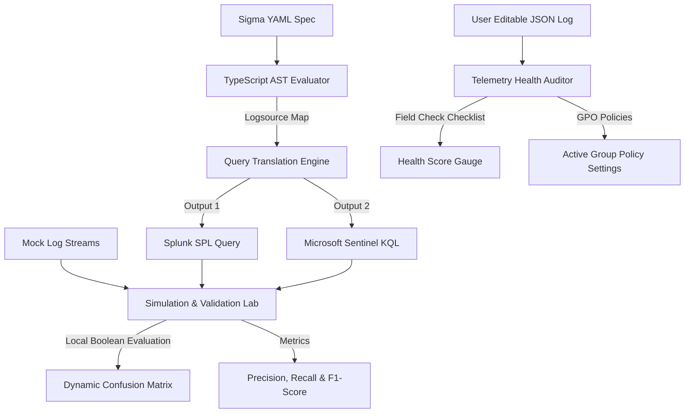

# Unified Detection Engineering Portfolio Walkthrough (Athena + MITRE)

This document acts as an operation manual and project walkthrough for the **Unified Detection Engineering Portfolio**—a fully client-side Detection-as-Code (DaC), validation, and telemetry audit dashboard built using Next.js, React, TypeScript, and Tailwind CSS.

---

## 🏗️ Architecture Overview

The unified portfolio demonstrates the complete **Threat Detection Engineering Lifecycle** running entirely in the browser:



---

## 📝 Threat Intel to Detection Lab

We added the **Threat Intel to Detection Lab** to demonstrate how detection rules are engineered directly from active intelligence briefings (e.g. CISA Advisories):
- **CISA Advisory Selection**: Users select real threat briefs, such as **APT29 Web Server Exploitation** or **LockBit Ransomware Persistence**. Crucial technical keywords and indicators are highlighted dynamically in the report block.
- **Construction Breakdown Guides**: Explains step-by-step how to identify file signatures, extract process commands, and map SIEM search logic from raw reporting.
- **YARA Binary Scanner**: Scans user-supplied payloads (auto-detecting hex streams versus ASCII text) to test string indicators like `$token` or headers like `$magic`.
- **KQL & SPL Telemetry Simulators**: Simulates live SIEM engines checking log events against compiled rules. Results output clear indicator matching reports (triggered alerts vs. filtered noise).

---

## 📥 Dynamic Custom Rule Registration & Testing (New)

Engineers can now fully author, register, and evaluate their own detection rules inside the live application state:
- **Registry Integration**: AUTHOR rules in the DaC Playground and click **"Register & Deploy to Active Rules Registry"**. This parses the Sigma YAML and injects the new rule dynamically into the registry state.
- **Global Propagation**: Authoring a custom rule instantly updates the rule dropdown selections in:
  1. The **SIEM Compiler Tab** (enabling live SPL/KQL translation).
  2. The **Rules Database Tab** (populating active registry tables and generating Palantir ADS spec documentation).
  3. The **Resilience Auditor Tab** (auditing resilience scores and highlighting pain-index categories).
  4. The **Simulation & Validation Lab** (populating test metrics dropdowns).
- **Interactive Test Suite Editor**: Inside the Simulation & Validation Lab, click **"✏️ Edit Test Dataset"** to view and edit a JSON array of simulated events for the active rule. Engineers can write custom benign (label: `benign`) and malicious (label: `malicious`) logs to test rules and recalculate Precision, Recall, and Confusion Matrices on-the-fly.

---

## 💻 Interactive Detection-as-Code (DaC) Playground

To make the platform an active, hands-on workspace for writing, testing, and implementing detections, we added the interactive **DaC Playground** workspace:
- **Live Sigma YAML Editor**: A monospaced code editing workspace featuring dynamic client-side parsing. It validates YAML syntax on-the-fly and displays validation status badges (Valid/Malformed).
- **Dual SIEM Compiler Pipeline**: Instantly compiles user-edited rules into functional Splunk SPL and Microsoft Sentinel KQL queries, updating dynamically as the engineer edits the logic.
- **Log Simulator**: Allows the engineer to input/paste a telemetry event payload in JSON format (pre-populated with starter logs). Clicking "Evaluate Detection Logic" evaluates the YAML selectors and boolean condition rules client-side to output an immediate green/amber alert trigger feedback state.

---

## 🗃️ Registry Rules & Palantir ADS (Alerting and Detection Strategy) Spec

We implemented 5 production-grade detection rules targeting Windows Endpoint (Sysmon), Identity (Active Directory), Cloud (AWS CloudTrail / Entra ID), and Network (DNS) domains. 

To ensure operational alignment, the **Rules Database** tab maps these rules to **Palantir's open-source Alerting & Detection Strategy (ADS) framework**. Expanding any registry rule displays:
- **Goal**: Clear plain-text objective of the alert.
- **Categorization**: MITRE tactic and technique mappings.
- **Known False Positives**: List of benign noise scenarios.
- **Incident Response Playbook**: Actionable numbered triage instructions.
- **Blind Spots & Assumptions**: Technical assumptions and bypass paths.
- **Technical Assets**: Raw Sigma YAML spec along with compiled Splunk SPL and Sentinel KQL queries.

### 1. Windows Endpoint: LSASS Memory Dumping (Sysmon Event ID 10)
* **Concept**: Detects unauthorized process access requests targeting `lsass.exe` requesting specific permissions (`0x1010`, `0x1410`, `0x1F1F`), while filtering out trusted platform processes like Svchost and Windows Defender.
* **Sigma/YAML Rule**: Stored inside [athena_data.ts](file:///c:/Users/user/Documents/AntiGravity/detection%20engineering/src/data/athena_data.ts#L77-L103)
* **Splunk SPL Compilation**:
  ```sql
  index=ep_sysmon sourcetype="XmlWinEventLog:Microsoft-Windows-Sysmon/Operational" (EventID="10" AND TargetImage="C:\Windows\System32\lsass.exe" AND GrantedAccess IN ("0x1010", "0x1410", "0x1F1F")) AND NOT (SourceImage="C:\Program Files\Windows Defender\MsMpEng.exe" OR SourceImage="C:\Windows\System32\svchost.exe")
  ```
* **Sentinel KQL Compilation**:
  ```sql
  SysmonEventLogs
  | where (EventID == 10 and TargetImage == "C:\Windows\System32\lsass.exe" and GrantedAccess in ("0x1010", "0x1410", "0x1F1F")) and not (SourceImage == "C:\Program Files\Windows Defender\MsMpEng.exe" or SourceImage == "C:\Windows\System32\svchost.exe")
  ```

### 2. Active Directory: Kerberoasting Attack (AD Security Event ID 4769)
* **Concept**: Detects Service Ticket Requests utilizing weak RC4 encryption (`0x17`) for user-accounts, while filtering out machine computer accounts (ending in `$`) and the domain controller ticket-granting account (`krbtgt`).
* **Sigma/YAML Rule**: Stored inside [athena_data.ts](file:///c:/Users/user/Documents/AntiGravity/detection%20engineering/src/data/athena_data.ts#L142-L164)
* **Splunk SPL Compilation**:
  ```sql
  index=ad_security sourcetype="WinEventLog:Security" (EventID="4769" AND TicketEncryptionType="0x17") AND NOT (ServiceName="*$" OR ServiceName="krbtgt")
  ```
* **Sentinel KQL Compilation**:
  ```sql
  SecurityEvent
  | where (EventID == 4769 and TicketEncryptionType == "0x17") and not (ServiceName endswith "$" or ServiceName == "krbtgt")
  ```

---

## 🧪 Simulation and Rule Validation Lab (Purple Teaming)

The **Simulation & Validation Lab** executes detection rules locally against mock purple team attack datasets containing simulated threat events (True Positives) and normal system noise (True Negatives).

During evaluation, the validation engine:
1. Loads the rule's simulated dataset.
2. Evaluates the boolean condition logic of the YAML selectors on each log record in real-time.
3. Computes:
   * **Precision**: Measures alert quality ($TP / (TP + FP)$). Low precision means high alert fatigue for SOC.
   * **Recall**: Measures coverage ($TP / (TP + FN)$). Low recall means critical security blindspots.
   * **F1-Score**: Harmonic accuracy mean ($2 \times \frac{Precision \times Recall}{Precision + Recall}$).
   * **Confusion Matrix**: 2x2 grid visualizing TP, FP, FN, TN.

---

## 📊 Telemetry Health & Gap Analysis

The **Telemetry Health Auditor** assesses log schemas to discover ingestion issues:
* It audits user-editable log JSON records against specific schema requirements.
* It highlights missing fields (e.g. if Sysmon Event ID 10 is missing `CallTrace` due to misconfigured configs).
* It provides a **Telemetry Health Score (0-100%)** and outputs **Group Policy Objects (GPO)** or cloud remediation configurations.

---

## 🚨 Incident Response (IR) Fast Scoper

To support active containment triaging:
* Input Hostnames, IPs, Usernames, and File Hashes into the Fast Scoper.
* It generates index-optimized, time-bounded scoping queries for both Splunk and Microsoft Sentinel, allowing incident responders to scan the entire environment during active incident response.

---

## 📐 Heuristic Resilience Auditor & Operational Axioms

To incorporate advanced security concepts and interview-prep philosophies, we added the **Resilience & Axioms** workspace:
- **Pyramid of Pain Rule Auditor**: A heuristic evaluation engine that inspects a rule's Sigma YAML strings and determines where it sits on David Bianco's Pyramid of Pain (from Hash Value to TTPs). It classifies rules as *Fragile* (Score 1-3), *Moderate* (Score 4-5), or *Resilient* (Score 6) and lists recommendations to pivot to higher-fidelity logic.
- **3D-Styled Pyramid of Pain stack visualizer**: A tilted 3D CSS container that highlights the audited rule's layer (e.g. glowing green for TTP, glowing red for Hash).
- **Interactive Operational Axioms Carousel**: Displays the 10 operational hot-takes and philosophies (axioms) for high-impact Detection Engineering extracted from raw course materials. Includes slide dot progress and prev/next navigation button actions.
- **Rules Database Integration**: Each deployed rule in the **Rules Database** is now automatically evaluated and labeled with a dynamic, color-coded resilience badge showing its exact pain index and layer classification.

---

## 🤖 MITRE ATLAS Integration (AI Security)

To address the security of Artificial Intelligence and Large Language Model systems, we integrated the **MITRE ATLAS (Adversarial Threat Landscape for Artificial-Intelligence Systems)** framework:
- **Interactive AI ATLAS Matrix**: Toggles dynamically on the Campaign Heatmap tab. Maps 9 custom tactics (Reconnaissance to Impact) and their respective techniques (like Prompt Injection, Model Extraction, and LLM Prompt Trickery).
- **Simulated AI Attack Scenario**: Pre-populates the **MITRE ATLAS: LLM Prompt Injection & Model Extraction** campaign. Simulates an adversary executing API probing, prompt injections, obfuscated jailbreaks, parameter extraction, and resource exhaustion DoS.
- **Production-Grade Prompt Injection Rule**: Deploys the `Adversarial LLM Prompt Injection Attempt` rule into the active rules registry, fully compiling to SPL/KQL and validating client-side.
- **Resilience Scoring for AI Rules**: Automatically evaluates prompt injection rules under the Heuristic Resilience Auditor, mapping them as Moderate resilience Network Artifacts and providing specific remediation pathways (e.g. Prompt Shields, Llama Guard, pre-processing decoders).

---

## 🚀 Deployed URL & Codebase

The application is deployed publicly on Vercel and is fully hosted client-side for zero execution latency:
* **Production Deployed Web App**: [https://athena-dac.vercel.app/](https://athena-dac.vercel.app/)
* **Git Repository**: [https://github.com/briwandt/athena-dac](https://github.com/briwandt/athena-dac)
